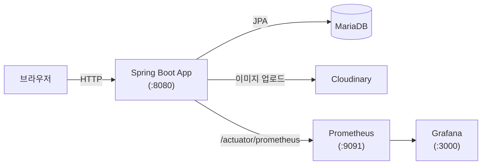
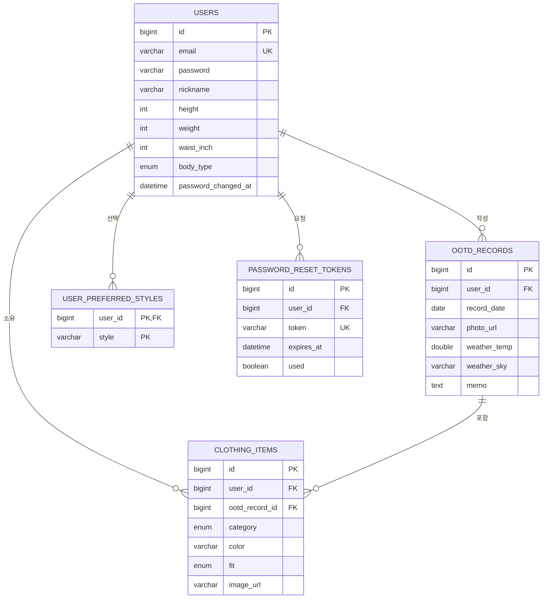

# TodayStyle (오늘의 코디)

> “뭐입을지모르겠어” — 오늘 입은 옷(OOTD)을 기록하고 관리하는 개인/소규모 서비스
> 

지인 대상 소규모 서비스로, 인프라를 단순하게 유지하기 위해 프론트엔드와 백엔드를 하나의 Spring Boot 서버에서 함께 서빙하는 구조로 만들었습니다.

## 기술 스택

**Backend**

- Java 21, Spring Boot 4.1.0
- Spring Data JPA, Spring Security, JWT(JJWT) 기반 인증
- MySQL/MariaDB, Flyway (스키마 버전 관리)
- Cloudinary (이미지 호스팅)

**Frontend**

- Vite + TypeScript
- 빌드 결과물을 백엔드 정적 리소스로 번들링해서 같은 서버에서 서빙 (CORS 부담 최소화)

**Infra & 운영**

- Docker / Docker Compose
- Prometheus + Grafana (모니터링)
- k6 (부하테스트)
- GitHub Actions (CI/CD)

## 아키텍처



프론트엔드(Vite/TS)는 빌드 시점에 정적 파일로 변환되어 Spring Boot 서버의 정적 리소스 경로에 포함됩니다. 즉 배포 단위는 서버 하나이며, 트래픽이 커지면 프론트/백엔드 분리를 고려할 예정입니다.

## 설계 결정 노트

몇 가지 설정은 별다른 이유 없이 기본값을 쓴 게 아니라, 아래와 같은 이유로 의도적으로 정한 것입니다.

- **Flyway + `ddl-auto: validate`** — 처음엔 Hibernate의 auto-DDL(`ddl-auto: update`)로 스키마를 관리했지만, 배포 시 예기치 않은 스키마 변경(컬럼 삭제/타입 변경이 반영 안 되는 등) 위험이 있어 Flyway로 교체했습니다. 이제 Hibernate는 엔티티-스키마 불일치만 검증(validate)하고 직접 스키마를 바꾸지 않습니다.
- **`forward-headers-strategy: framework`** — nginx가 리버스 프록시로 앞단에 있어서, 실제 클라이언트 IP는 `X-Forwarded-For` 헤더로 전달됩니다. 이 설정이 없으면 Spring이 그 헤더를 무시해서 `request.getRemoteAddr()`가 항상 nginx의 내부 IP로만 찍히고, IP별 요청 제한(Rate Limit)이 사실상 전체 트래픽에 대해 하나로 뭉쳐집니다. 8080 포트는 보안그룹에서 막혀 있어 nginx를 거치지 않은 직접 요청이 불가능하므로, 헤더를 위조해서 들어올 경로가 없어 안전하게 켤 수 있습니다.
- **모니터링 포트 분리 (`management.server.port: 9090`)** — Prometheus/Grafana용 메트릭 엔드포인트를 메인 API 포트(8080)와 분리했습니다. `management.server.port`를 설정하면 Spring Boot가 이 엔드포인트들을 메인 SecurityFilterChain이 전혀 적용되지 않는 별도 내장 서버로 분리해줍니다. EC2 보안그룹은 80/443/22만 열려있어 9090은 외부에서 애초에 접근 불가능하고, 로컬/도커 네트워크 안에서만(Prometheus 컨테이너 등) 닿습니다.
- **JWT secret 기본값 없음** — `jwt.secret`에 기본값을 두지 않아서, 환경변수를 안 채우면 앱이 아예 기동에 실패합니다. 공개 저장소에 기본값을 박아두면 그 저장소를 본 누구나 그 값으로 토큰을 위조할 수 있기 때문입니다.
- **OOTD 업로드 후처리는 별도 스레드풀(`@Async`)로 분리** — 업로드 직후 날씨 스냅샷 조회, Gemini 기반 옷 아이템 자동 인식을 비동기로 처리합니다. 요청 스레드를 붙잡지 않으면서도 무제한 스레드 생성은 막기 위해 풀 크기(core 2 / max 4 / queue 50)를 명시적으로 제한했습니다.
- **선택 기능은 실패해도 앱/헬스체크에 영향 없음** — Cloudinary, 기상청 API, Gemini, SMTP, Discord는 키가 없거나 호출에 실패해도 앱이 정상 기동·동작합니다(예: 비밀번호 재설정 메일 실패 시 로그만 남기고 서비스는 계속 동작). 메일 헬스체크도 꺼둬서(`health.mail.enabled: false`) 선택 기능 장애가 전체 헬스 상태를 왜곡하지 않게 했습니다.

## 폴더 구조 (상위 레벨)

```
todaystyle/
├── src/                    # 백엔드 소스 (Spring Boot)
├── frontend/                # 프론트엔드 소스 (Vite + TypeScript)
├── loadtest/                 # k6 부하테스트 스크립트
├── monitoring/               # Prometheus / Grafana 설정
├── gradle/wrapper/
├── .github/workflows/         # CI/CD 파이프라인
├── build.gradle
├── docker-compose.yml
├── Dockerfile
└── deploy.sh
```

계층(controller/service/repository)이 아니라 **도메인(기능) 단위로 패키지를 나눈 구조**입니다. 각 도메인 패키지 안에 그 도메인의 컨트롤러/서비스/레포지토리/엔티티/예외/DTO가 함께 모여 있습니다.

```
src/main/java/com/example/todaystyle/
├── user/                    # 회원, 인증
│   ├── User.java                     (엔티티)
│   ├── AuthController.java
│   ├── AuthService.java
│   ├── UserRepository.java
│   ├── PasswordResetToken.java       (엔티티)
│   ├── PasswordResetTokenRepository.java
│   ├── PasswordResetMailSender.java
│   ├── BodyType.java / StyleCategory.java
│   ├── DuplicateEmailException.java 등
│   └── dto/                          (SignUpRequest, LoginRequest, TokenResponse 등)
│
├── ootd/                    # 오늘의 코디 기록
│   ├── OotdRecord.java               (엔티티)
│   ├── OotdController.java / OotdService.java / OotdRepository.java
│   ├── OotdEnrichmentListener.java   (업로드 후 비동기 보강 처리)
│   ├── ImageSignature.java           (매직바이트 검증)
│   └── dto/
│
├── clothing/                # 코디를 구성하는 옷 아이템
│   ├── ClothingItem.java             (엔티티)
│   ├── ClothingItemController.java / Service.java / Repository.java
│   ├── ClothingCategory.java / Fit.java
│   └── dto/
│
├── recommendation/          # 코디 추천 로직
│   ├── RecommendationController.java
│   ├── CombinationRecommendationService.java
│   ├── ColorHarmony.java / StyleFitRules.java / BodyTypeStyleRules.java
│   └── dto/
│
├── recognition/             # 이미지 기반 의류 인식 (Gemini API 연동)
│   ├── ClothingRecognitionService.java
│   ├── GeminiClothingRecognitionService.java
│   └── DetectedClothingItem.java
│
├── weather/                 # 날씨 연동 (기상청 API)
│   ├── WeatherController.java / WeatherService.java
│   ├── KmaWeatherClient.java / GridConverter.java
│   └── dto/
│
├── security/                 # 인증/인가
│   ├── SecurityConfig.java
│   ├── JwtTokenProvider.java / JwtAuthenticationFilter.java
│   └── RateLimiter.java / RateLimitInterceptor.java
│
├── common/                   # 공통 설정 및 유틸
│   ├── GlobalExceptionHandler.java / PageResponse.java / BaseTimeEntity.java
│   ├── storage/               # Cloudinary 이미지 업로드
│   └── logging/                # 에러 발생 시 Discord 알림
│
└── TodaystyleApplication.java
```

## 엔티티 & ERD

핵심 엔티티: `User`(사용자), `OotdRecord`(하루의 코디 기록), `ClothingItem`(코디를 구성하는 개별 옷 아이템), `PasswordResetToken`(비밀번호 재설정 토큰), `UserPreferredStyle`(사용자가 고른 선호 스타일, 복수 선택 가능).

- 한 사용자는 여러 개의 OOTD 기록을 가질 수 있습니다 (1:N, 사용자+날짜 조합은 유니크)
- 하나의 OOTD 기록은 여러 개의 옷 아이템으로 구성됩니다 (1:N)
- 한 사용자는 여러 개의 선호 스타일을 가질 수 있습니다 (1:N, 원래는 단일 선택이었으나 V3 마이그레이션에서 복수 선택으로 변경)
- 비밀번호 재설정 요청 시 토큰이 발급되며(1:N), `users.password_changed_at`으로 비밀번호 변경 이전에 발급된 JWT를 무효화합니다



## 실행 방법

```bash
# 1. 환경변수 설정
cp .env.example .env

# 2. DB + 모니터링 스택까지 한 번에 실행
docker-compose up -d

# 3. 로컬 개발 시 백엔드만 별도 실행
./gradlew bootRun
```

- API 서버: http://localhost:8080
- Grafana 대시보드: http://localhost:3000
- Prometheus: http://localhost:9091 (로컬 전용)

### 환경변수 (.env)

실제 키 값은 레포에 포함되어 있지 않습니다(`.gitignore` 처리). `.env.example`을 복사해서 아래 값을 채워주세요.

| 변수명 | 용도 | 필수 여부 | 발급처 |
| --- | --- | --- | --- |
| `DB_USERNAME`, `DB_PASSWORD` | DB 접속 정보 | 필수 | 직접 설정 |
| `JWT_SECRET` | 토큰 서명용 비밀키 (32byte 이상 랜덤값) | 필수 | 직접 생성 |
| `JWT_EXPIRATION_MS` | 토큰 만료 시간(ms) | 필수 (기본값 있음) | 직접 설정 |
| `CORS_ALLOWED_ORIGINS` | 허용할 프론트 origin | 필수 | 배포 환경에 맞게 설정 |
| `KMA_SERVICE_KEY` | 기상청 API (날씨 정보 연동) | 날씨 기능 사용 시 필수 | 공공데이터포털 |
| `CLOUDINARY_CLOUD_NAME` / `CLOUDINARY_API_KEY` / `CLOUDINARY_API_SECRET` | 이미지 업로드/호스팅 | 이미지 업로드 기능 시 필수 | Cloudinary 대시보드 |
| `SMTP_USERNAME`, `SMTP_PASSWORD` | 이메일 발송 (비밀번호 재설정 등) | 선택 | Gmail 앱 비밀번호 |
| `APP_BASE_URL` | 이메일 내 링크 등에 쓰이는 앱 주소 | 선택 | 직접 설정 |
| `DISCORD_WEBHOOK_URL` | 에러 알림 | 선택 | Discord 채널 웹훅 URL |
